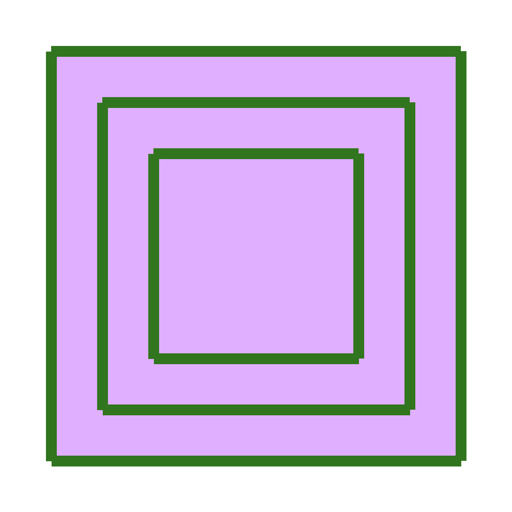
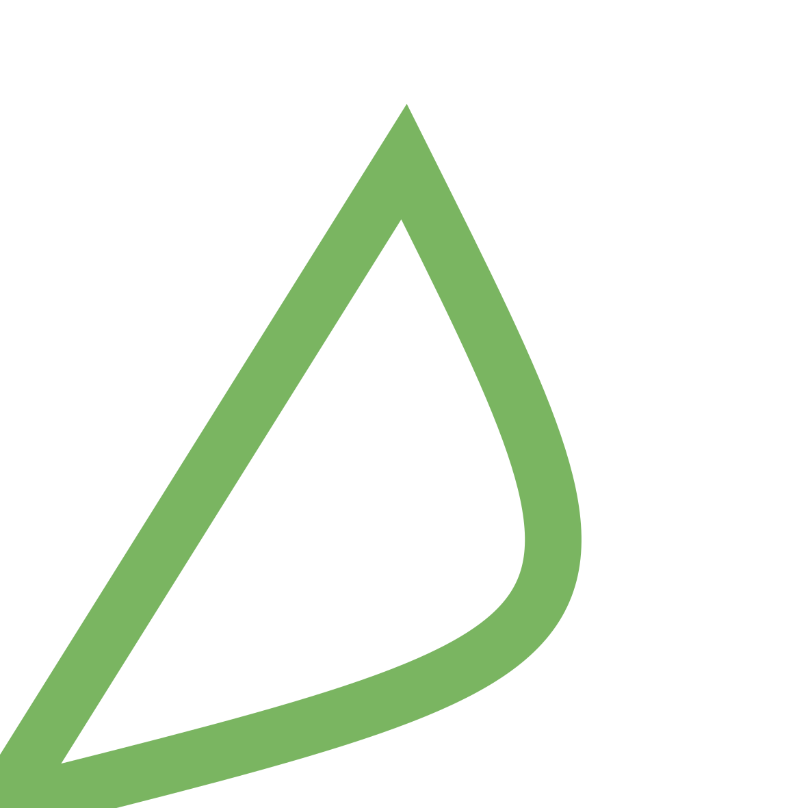
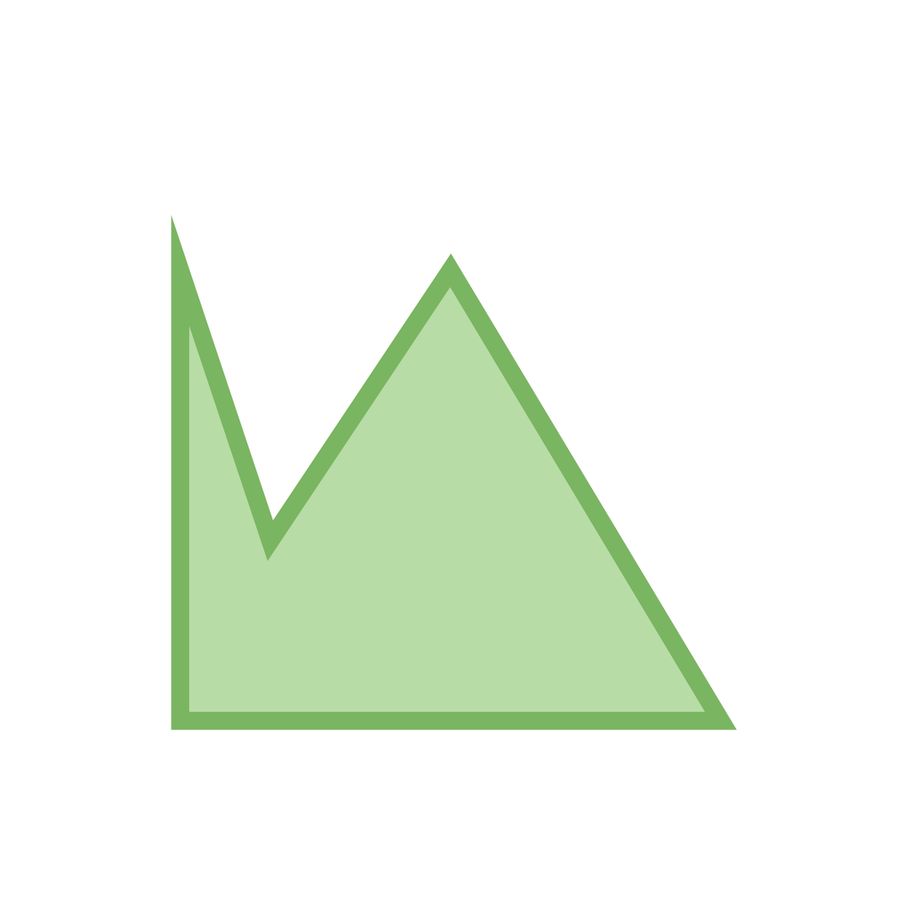
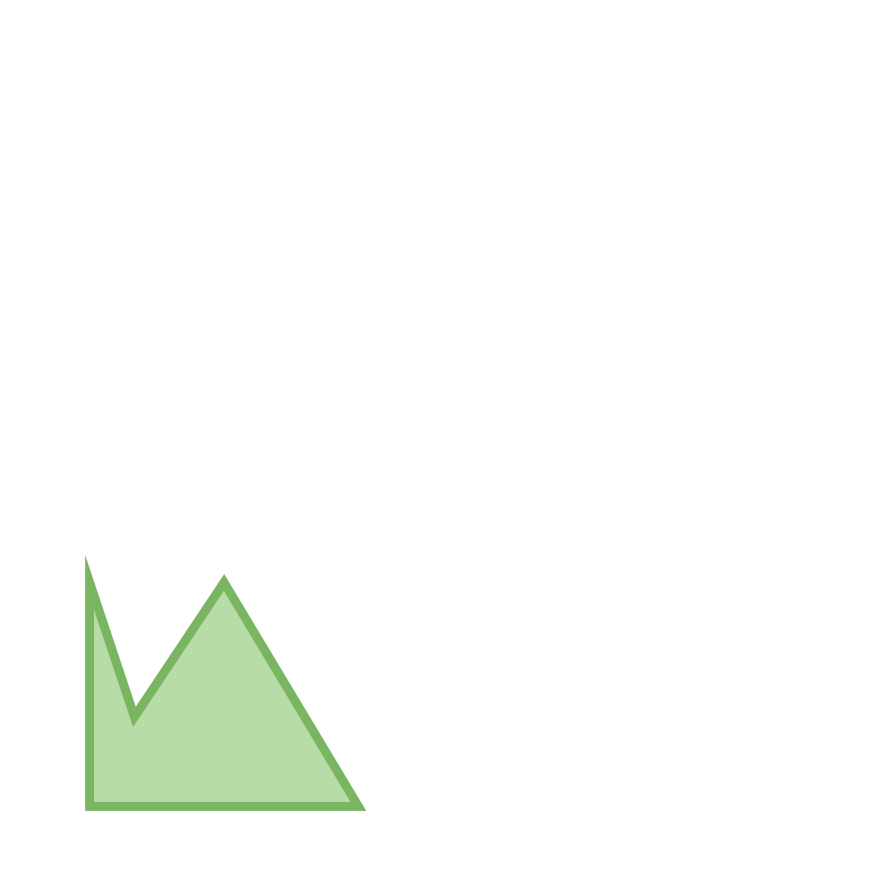
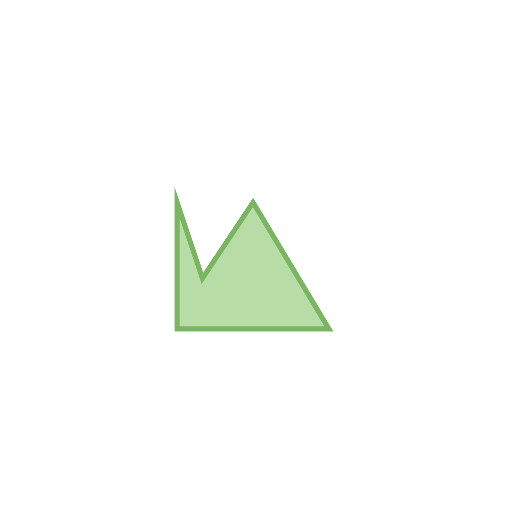
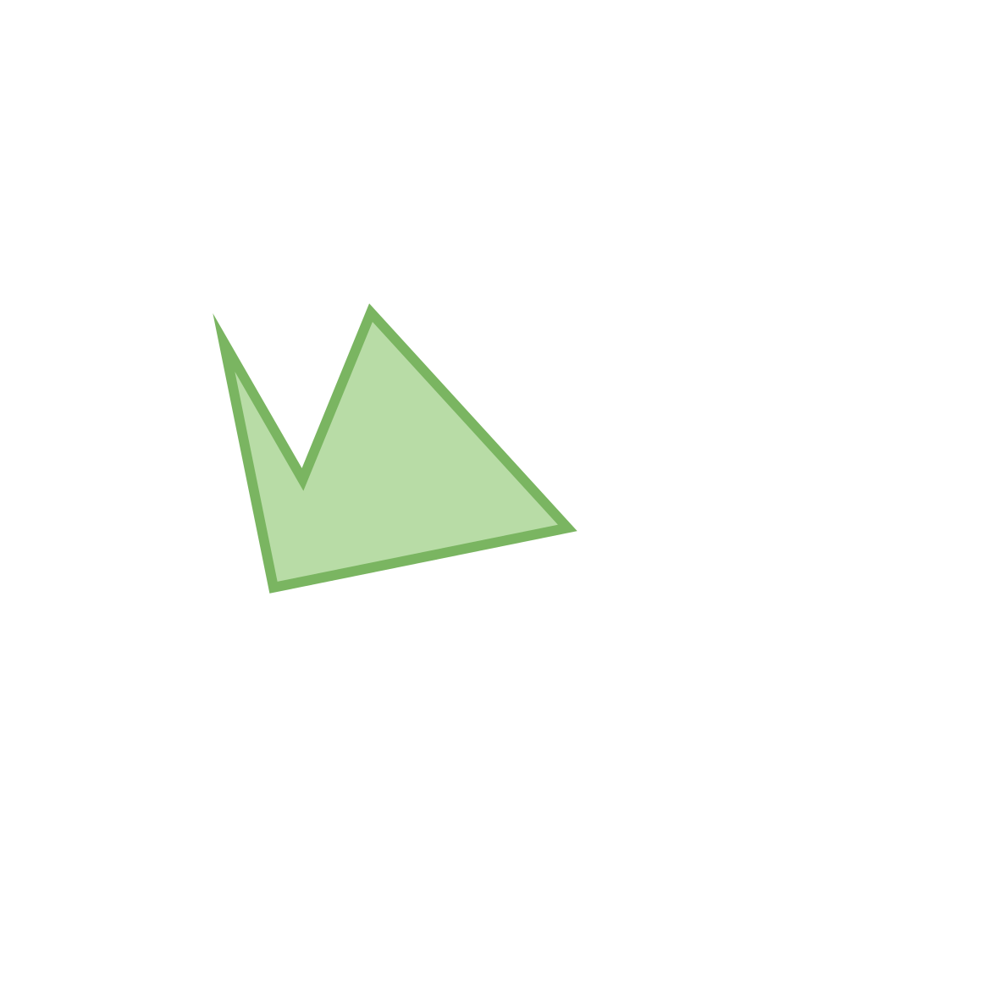
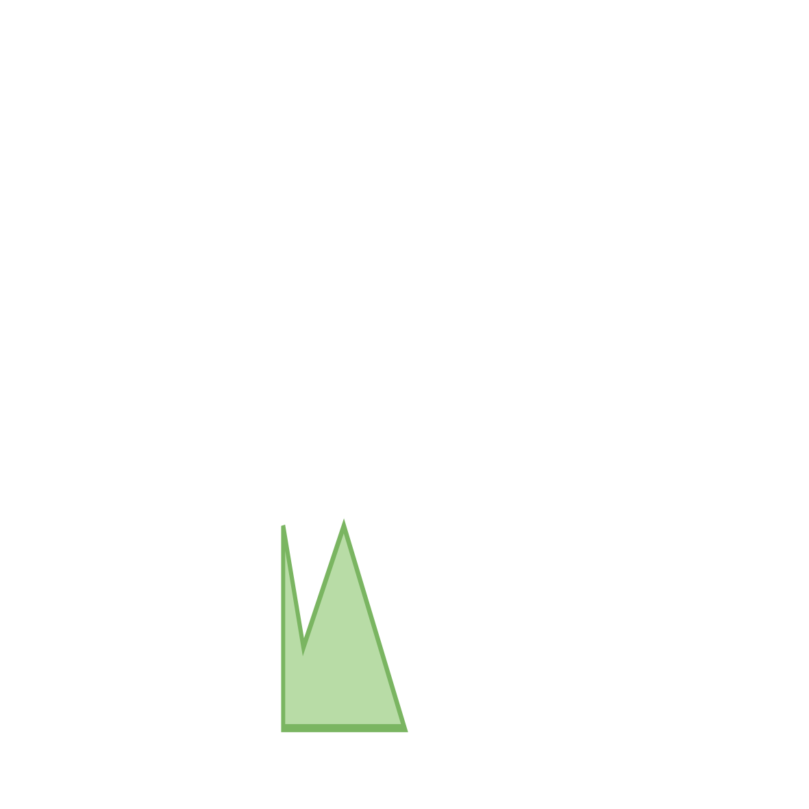
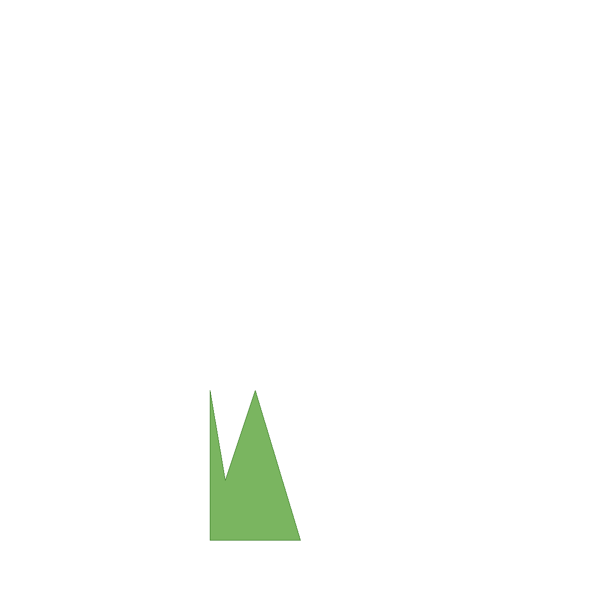

<br />
<p align="center">
  <h3 align="center">
	Vgr_pixmap test repository
  </h3>

  <p align="center">
    Temporary repository to store test programs for the WIP
    <a href="https://github.com/EmileRolley/vgr-pixmap"<code>Vgr_pixmap</code></a>
    renderer.
  <!-- <br /> -->
   <!--  <a href="https://github.com/github_username/repo_name"><strong>Explore the docs »</strong></a> -->
    <br />
   <!--  <a href="https://github.com/github_username/repo_name">View Demo</a> -->
    <a href="https://github.com/EmileRolley/sustainable-computing-resources/issues">Report Bug</a>
    ·
    <a href="https://github.com/EmileRolley/sustainable-computing-resources/pulls">Contribute</a>
  </p>
</p>


<details>
  <summary>Table of Contents</summary>

<!-- vim-markdown-toc GitLab -->

* [Results](#results)
  * [Rendering showcase](#rendering-showcase)
    * [Two straight lines](#two-straight-lines)
    * [1. Two closed sub-paths](#1-two-closed-sub-paths)
    * [2. Imbricated and non-zero filled squares (not same direction)](#2-imbricated-and-non-zero-filled-squares-not-same-direction)
    * [3. Imbricated and non-zero filled squares (same direction)](#3-imbricated-and-non-zero-filled-squares-same-direction)
    * [4. Closed cubic Bézier curve](#4-closed-cubic-bézier-curve)
    * [5. Filled cubic Bézier curve](#5-filled-cubic-bézier-curve)
    * [6. Multiple filled cubic Bézier curves](#6-multiple-filled-cubic-bézier-curves)
    * [7. Quadratic Bézier curve](#7-quadratic-bézier-curve)
    * [8. Non-zero filled star](#8-non-zero-filled-star)
    * [9. Even-odd filled star](#9-even-odd-filled-star)
    * [10. Simple polygon with border](#10-simple-polygon-with-border)
    * [11. Scaled polygon](#11-scaled-polygon)
    * [12. Translated polygon - _`NOT PASSING`_](#12-translated-polygon-_not-passing)
    * [13. Rotated polygon](#13-rotated-polygon)
    * [14. Applied transformation matrix - _`NOT PASSING`_](#14-applied-transformation-matrix-_not-passing)
  * [~~Rendering time comparison~~ _Deprecated_](#rendering-time-comparison-_deprecated)

<!-- vim-markdown-toc -->

</details>

---

## Results

Result images produced by the `Vgr_cairo` and `Vgr_pixmap` are stored in `./imgs/`.

And could be re-rendered by executing:
```
dune build && ./_build/default/bin/main.exe
```

### Rendering showcase

The left image isrendered with [`Vgr_cairo`](https://erratique.ch/software/vg/doc/Vgr_cairo/index.html)
the right one is rendered with [`Vgr_pixmap`](https://github.com/EmileRolley/vgr-pixmap/pull/1).

#### Two straight lines

<details>
  <summary>Show source code</summary>

```ocaml
let two_stroked_straight_lines = P.empty
  |> P.sub (v 0.2 0.3)
  |> P.line (v 0.75 0.5)
  |> P.line (v 0.2 0.85)
  |> simple_cut
```

</details>

<center>
  <div  style="display: flex; flex-direction: row; align-items: flex-start">
    
    
  </div>
</center>

---

#### 1. Two closed sub-paths

<details>
  <summary>Show source code</summary>

```ocaml
let closed_sub_paths = P.empty
  |> P.sub (v 0.2 0.) |> P.line (v 0.5 0.25) |> P.sub (v 0.5 0.5)
  |> P.line (v 0.6 0.5) |> P.line (v 0.6 0.6) |> P.close |> simple_cut
```

</details>

<center>
  <div style="display: flex; flex-direction: row; align-items: flex-start">
    
    
  </div>
</center>

---

#### 2. Imbricated and non-zero filled squares (not same direction)

<details>
  <summary>Show source code</summary>

```ocaml
let imbricated_filled_squares_not_same_dir =  P.empty
  |> P.rect (Box2.v (v 0.25 0.25) (v 0.5 0.5))
  |> P.sub (v 0.3 0.3)
  |> P.line (v 0.3 0.7)
  |> P.line (v 0.7 0.7)
  |> P.line (v 0.7 0.3)
  |> P.close
  |> filled_with_border ~area:`Anz ~c:(Color.v 0.88 0.69 1. 1.)
```

</details>

<center>
  <div style="display: flex; flex-direction: row; align-items: flex-start">
    
    
  </div>
</center>

---

#### 3. Imbricated and non-zero filled squares (same direction)

<details>
  <summary>Show source code</summary>

```ocaml
let imbricated_filled_squares_same_dir = P.empty
  |> P.rect (Box2.v (v 0.1 0.1) (v 0.8 0.8))
  |> P.rect (Box2.v (v 0.2 0.2) (v 0.6 0.6))
  |> P.rect (Box2.v (v 0.3 0.3) (v 0.4 0.4))
  |> filled_with_border ~area:`Anz ~c:(Color.v 0.88 0.69 1. 1.)
```

</details>

<center>
  <div style="display: flex; flex-direction: row; align-items: flex-start">
    
    
  </div>
</center>

---

#### 4. Closed cubic Bézier curve

<details>
  <summary>Show source code</summary>

```ocaml
let closed_cbezier = P.empty
  |> P.ccurve (v 0.8 0.2) (v 0.8 0.2) (v 0.5 0.8)
  |> P.close
  |> simple_cut
```

</details>

<center>
  <div style="display: flex; flex-direction: row; align-items: flex-start">
    
    
  </div>
</center>

---

#### 5. Filled cubic Bézier curve

<details>
  <summary>Show source code</summary>

```ocaml
let filled_cbezier = P.empty
  |> P.ccurve (v 0.8 0.2) (v 0.8 0.2) (v 0.5 0.8)
  |> P.close
  |> simple_filled_cut ~area:`Aeo ~c:(Color.v 0.48 0.71 0.38 1.)
```

</details>

<center>
  <div style="display: flex; flex-direction: row; align-items: flex-start">
    
    
  </div>
</center>

---

#### 6. Multiple filled cubic Bézier curves

<details>
  <summary>Show source code</summary>

```ocaml
let mult_filled_cbeziers = P.empty
  |> P.ccurve (v 0.6 0.2) (v 0.6 0.2) (v 0.5 0.8)
  |> P.ccurve (v 0.8 0.2) (v 0.8 0.2) (v 0.6 0.3)
  |> P.close
  |> simple_filled_cut ~area:`Aeo ~c:(Color.v 0.48 0.71 0.38 1.)
```

</details>

<center>
  <div style="display: flex; flex-direction: row; align-items: flex-start">
    
    
  </div>
</center>

---

#### 7. Quadratic Bézier curve

<details>
  <summary>Show source code</summary>

```ocaml
let simple_qbezier = P.empty
  |> P.qcurve (v 0.8 0.2) (v 0.6 0.8) |> P.close |> simple_cut
```

</details>

<center>
  <div style="display: flex; flex-direction: row; align-items: flex-start">
    
    
  </div>
</center>

---

#### 8. Non-zero filled star

<details>
  <summary>Show source code</summary>

```ocaml
let nz_star = P.empty
  |> P.sub (v 0.2 0.1)
  |> P.line (v 0.5 0.9)
  |> P.line (v 0.8 0.1)
  |> P.line (v 0.1 0.65)
  |> P.line (v 0.9 0.65)
  |> P.close
  |> filled_with_border ~area:`Anz ~c:(Color.v 0.48 0.71 0.38 1.)
```

</details>

<center>
  <div style="display: flex; flex-direction: row; align-items: flex-start">
    
    
  </div>
</center>

---

#### 9. Even-odd filled star

<details>
  <summary>Show source code</summary>

```ocaml
let eo_star = P.empty
  |> P.sub (v 0.2 0.1)
  |> P.line (v 0.5 0.9)
  |> P.line (v 0.8 0.1)
  |> P.line (v 0.1 0.65)
  |> P.line (v 0.9 0.65)
  |> P.close
  |> filled_with_border ~area:`Aeo ~c:(Color.v 0.48 0.71 0.38 1.)
```

</details>

<center>
  <div style="display: flex; flex-direction: row; align-items: flex-start">
    
    
  </div>
</center>

---

#### 10. Simple polygon with border

<details>
  <summary>Show source code</summary>

```ocaml
let poly1 = P.empty
  |> P.sub (v 0.2 0.2)
  |> P.line (v 0.2 0.7)
  |> P.line (v 0.3 0.4)
  |> P.line (v 0.5 0.7)
  |> P.line (v 0.8 0.2)
  |> P.close
  |> filled_with_border ~area:`Aeo ~c:(Color.v 0.48 0.71 0.38 1.)
```

</details>

<center>
  <div style="display: flex; flex-direction: row; align-items: flex-start">
    
    
  </div>
</center>

---

#### 11. Scaled polygon

<details>
  <summary>Show source code</summary>

```ocaml
let scaled_poly = I.scale (v 0.5 0.5) poly1
```

</details>

<center>
  <div style="display: flex; flex-direction: row; align-items: flex-start">
    
    
  </div>
</center>

---

#### 12. Translated polygon - _`NOT PASSING`_

<details>
  <summary>Show source code</summary>

```ocaml
let moved_poly = I.move (v 0.5 0.5) scaled_poly
```

</details>

<center>
  <div style="display: flex; flex-direction: row; align-items: flex-start">
    
    
  </div>
</center>

---

#### 13. Rotated polygon

<details>
  <summary>Show source code</summary>

```ocaml
let rotated_poly = I.rot 0.20 moved_poly
```

</details>

<center>
  <div style="display: flex; flex-direction: row; align-items: flex-start">
    
    
  </div>
</center>

---

#### 14. Applied transformation matrix - _`NOT PASSING`_

<details>
  <summary>Show source code</summary>

```ocaml
let m_poly = I.tr M3.(v 0.5 0. 0.3 0. 1. 0. 0. 0. 1.) scaled_poly
```

</details>

<center>
  <div style="display: flex; flex-direction: row; align-items: flex-start">
    
    
  </div>
</center>

### ~~Rendering time comparison~~ _Deprecated_

<details>

|                   `Vg` image (1181x1181) | `Vgr_cairo` rendering time | `Vgr_pixmap` rendering time |
|-----------------------------------------:|:--------------------------:|:---------------------------:|
|               two_stroked_straight_lines |          0.055174s         |          0.000070s          |
|                         closed_sub_paths |          0.055282s         |          0.000061s          |
|   imbricated_filled_squares_not_same_dir |          0.058220s         |          0.004771s          |
| cairo-imbricated_filled_squares_same_dir |          0.075290s         |          0.012154s          |
|                           closed_cbezier |          0.058570s         |          0.000137s          |
|                           filled_cbezier |          0.054751s         |          0.006338s          |
|                     mult_filled_cbeziers |          0.054836s         |          0.003525s          |
|                           simple_qbezier |          0.056556s         |          0.000127s          |
|                       non_zero_rule_star |          0.052657s         |          0.004548s          |
|                       even_odd_rule_star |          0.053657s         |          0.003701s          |
|                                     poly |          0.055466s         |          0.007711s          |
|                              scaled_poly |          0.058964s         |          0.002356s          |
|                               moved_poly |          0.058006s         |          0.002909s          |
|                            rotated_poly' |          0.058723s         |          0.003000s          |
|                          tr_matrix_poly' |          0.057560s         |          0.001019s          |

</details>
